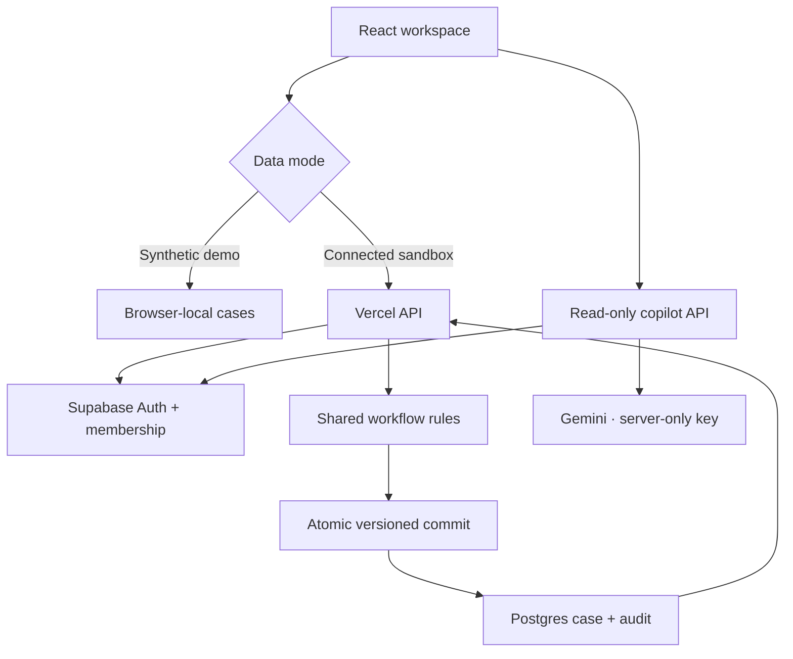
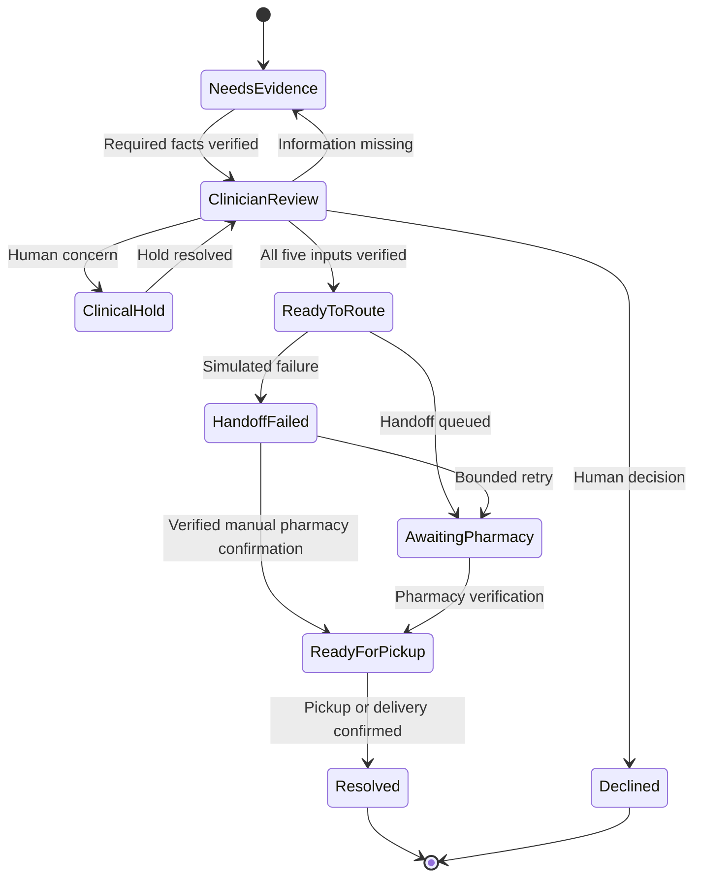

# Product and engineering brief

## Focus

The initial customer is an independent US primary-care group with 5–30 clinicians and a central refill team. The buyer is the practice manager; refill coordinators use the system daily; a clinical sponsor defines review boundaries; a pharmacy partner validates fulfillment. This is a proposed beachhead, not market research or a claim of existing customer demand.

The bottleneck is unresolved dependency ownership. A shared case asks: what is missing, who can verify it, what evidence is needed, and has the next handoff actually happened? Patients receive a simplified status instead of having to reconstruct the process themselves.

## Runnable scope

| Component | Implemented | Limitation |
|---|---|---|
| React + TypeScript + Vite | Six views and complete sample workflow | Synthetic data only |
| Workflow engine | Deterministic rules shared by client demo and server | Example workflow, not a clinical protocol |
| Local demo | Seed cases, role simulation, independent in-memory visits | No access control; reload restores sample data |
| Vercel API | Session validation, membership lookup, role enforcement | Requires user configuration and hosted verification |
| Supabase/Postgres | Schema, RLS, read grants, atomic state/audit RPC | One workspace per user; no cross-org case-level ACL |
| Integrations | Simulated queue, failure, pharmacy confirmation | No real EHR, pharmacy, insurance, or notification adapter |
| Intelligence | Deterministic blockers plus three read-only Gemini copilots | Requires server key; no clinical decisions or model-driven workflow writes |
| Waiting attention | Per-visit simulation over the saved per-action start; 3 minutes = 30 simulated hours; live count/filter | Derived queue state, no background notifications or automatic resolution |
| Growth | Stage transitions, pilot criteria, buyer map, pricing/ROI hypothesis | Does not send campaigns or manage a real CRM |

## Architecture



Clinical source systems remain authoritative in a future deployment. The database stores workflow evidence, ownership, version, patient-update previews, and event history. It does not issue prescriptions. The prototype uses JSON case documents for a fast vertical slice; a production system should normalize evidence, messages, and events and use paginated reads rather than returning the full working set.

## State and decision rules

Five mandatory evidence flags each contribute three units. The score has only six possible values: 0, 3, 6, 9, 12, and 15. The educational lab supports every integer signal from 0 to 15.

```text
readiness = 3 × count(verified requirements)
comparator_output = readiness >= 15 ? readiness : 0
can_route = comparator_output > 0
            AND every mandatory requirement verified
            AND NOT clinical_hold
            AND NOT declined
```

The score cannot compensate for a missing requirement. Clinician approval requires verified identity, prescription details, and visit/review disposition. Coverage may be resolved separately; routing requires it. Identity mismatch invalidates identity evidence and prior approval. A hold invalidates approval. Releasing a pre-dispatch hold still requires a new authorization.



Coverage blocking is an additional independent dependency before ReadyToRoute. The UI derives the most actionable status from the record rather than letting a user set arbitrary status text. A clinical hold after dispatch blocks local progress and requires direct pharmacy reconciliation; automated cancellation and reopening are deliberately not implemented.

## Waiting and Needs Attention

A case stores `waitingSince`, the start of its currently required step. `attention(case, now)` is derived from a pending next action and elapsed time ≥180,000 ms. At exactly three minutes, the simulated wait is 30 hours. The count and filter update every second and on focus. A fresh page visit projects a new start for each pending case, tracked in session storage. The Restart timer control updates only this projection. Role changes, viewing, polling, and expiry preserve the current visit’s clock. There is no in-memory `setTimeout` capable of changing a case later.

Needs Attention is orthogonal to `state(case)`. It cannot alter transport, owner, evidence, signal, events, version, or `resolvedAt`. Completing the current step starts a fresh timer for the next step; confirmed pickup and decline stop the timer. Merely viewing the case, asking Gemini, saving a message preview, requesting information, failing a retry, or recording escalation cannot hide the unresolved wait. Failed retries retain their original wait even when the next action becomes escalation.

Every demo page load restores all six original sample cases; the in-memory demo store is isolated per document and never reads legacy localStorage. Connected records retain their database history. Both modes get a fresh three-minute presentation timer on every page load. Durable `waitingSince` remains the actual workflow timestamp. Restart timer changes no workflow evidence or Supabase records. Legacy connected records fall back to their last progress event or creation time until the next workflow action persists the field. No SQL migration is required. Browser demo timing trusts the device clock; connected display timing uses a server time offset, and the copilot evaluates its snapshot on the server. This is an accelerated demonstration, not a clinical urgency or production SLA policy.

## Roles

| Action | Practice staff | Clinician | Pharmacy |
|---|---|---|---|
| Create synthetic intake | Yes | No | Yes |
| Verify identity / prescription | Yes | No | Yes |
| Resolve coverage administration | Yes | No | Yes |
| Record visit decision | No | Yes | No |
| Authorize / decline / hold | No | Yes | No |
| Route / retry | Yes | No | Yes |
| Confirm pharmacy readiness / pickup | No | No | Yes |
| Prepare patient update | Yes | Yes | Yes |
| Flag identity mismatch | Yes | Yes | Yes |

In the demo, the selector simulates a role. In connected mode, the server gets the role from the membership table after validating the Supabase access token. The browser never supplies an authoritative role. All members of a synthetic workspace can read its cases; this is not sufficient minimum-necessary access for production cross-organization data.

## API

`GET /api/workspace`, with `Authorization: Bearer <access token>`, returns authorized tenant cases plus role, actor display name, tenant name, and server time. Connected clients poll every five seconds and on focus; lower-version responses cannot overwrite a newer local action result. Responses use `Cache-Control: private, no-store`.

`POST /api/workspace` with `Content-Type: application/json` supports:

```json
{
  "operation": "act",
  "caseId": "RX-1042",
  "action": {
    "type": "approve",
    "note": "Synthetic evidence describing the clinician decision.",
    "requestId": "526bfc4c-e28c-4fcb-9bdd-49e0868dc20f",
    "expectedVersion": 1,
    "simulateFailure": false
  }
}
```

The server validates membership, permitted action, evidence length, current state, and version. The service-only RPC commits the new case and audit record together. Idempotency is scoped to the tenant and request ID, with a command hash to reject reuse for another command. Case versions reject stale concurrent changes. An uncertain client response must be followed by a refresh; it is not evidence of success or failure.

Creation uses `operation: "create"`, a `requestId`, a synthetic `patient` alias, `medication`, and one of the five defined `reason` strings. The resulting initial evidence is explicitly fictional. No connected-data extraction is implied.

Important errors: 401 invalid session, 403 unauthorized role/membership, 404 unknown case, 409 conflict, 413 oversized request, 415 wrong content type, 422 invalid workflow action, 503 unavailable/unconfigured dependency.

## Reliability and observability

Implemented: strict state transitions, event timestamps and actors, mandatory notes, request IDs, optimistic concurrency, database transactions, input bounds, a simulated failure switch, three total dispatch attempts, escalation, and no premature completion.

The application has no durable external outbox or background worker. A future real connector needs an outbox written in the same transaction as the state change, leased jobs, bounded exponential backoff, a dead-letter queue, signature-verified callbacks, and reconciliation against the pharmacy's authoritative outcome. A timeout must produce “outcome unknown,” not a new prescription. Use one stable external idempotency key per logical handoff.

Proposed operational telemetry: action failures by reason, queue age distribution, time awaiting each role, unacknowledged handoffs, retry count, version conflicts, and message delivery failures. Logs must use pseudonymous case references and omit medication details, notes, tokens, and patient identifiers. The prototype's user-facing event trail is implemented; centralized telemetry, alerting, and incident response are not.

## AI judgment

The authorization gates remain deterministic. All three role copilots use the same server-side Gemini `generateContent` integration with distinct role instructions:

| Copilot | Assistance | Human boundary |
|---|---|---|
| Practice Staff | Blockers, attention reason, owner, next administrative action, message drafts | Cannot verify evidence, send messages, or authorize |
| Clinician | Case summary, pending review, verified/missing information, documentation drafts | Never makes a clinical prescribing decision |
| Pharmacy | Handoff status, outstanding verification, routing versus fulfillment, missing pickup confirmation | Cannot acknowledge or dispense |

`POST /api/copilot` receives a question, role, snapshot key, and at most six conversation turns from that same snapshot. In demo mode it validates a minimized synthetic case payload. In connected mode it ignores browser-supplied evidence, validates Supabase membership, restricts the role, and reads the case by tenant and case ID. It re-reads the case after Gemini responds. No database writes or workflow action tools are exposed to Gemini.

Context includes the actual workflow state, attention flag, waiting start, next action, owner, five evidence checks, hold/decline flags, transport, completion timestamp, and recent events. Patient names and medication fields are omitted; synthetic evidence notes and questions are sent, so users must still avoid real patient data. Notes, questions, and history are treated as untrusted data in the prompt. Explanations cannot create authorization or verification. The live facts card is deterministic and explicitly labeled as not an AI answer.

The snapshot key changes with case version, role, pending step, wait start, or attention threshold. The browser aborts outstanding questions when that key changes, hides earlier guidance, and never includes it in new model context. The server rejects stale requests and responses with HTTP 409. A changed case requires a new question; the app does not silently trigger another paid model call.

The key is `GEMINI_API_KEY`, kept server-side. `GEMINI_MODEL` is configurable. The Vercel function budget is 30 seconds, with a 26-second overall request deadline and at most two 9-second provider attempts. Requests have bounded text/history and no-store responses, and a per-instance rate limit (12 per user/IP and 40 total per minute). These limits are not shared across serverless instances; use access protection and durable rate limiting before a public commercial deployment. Set `DEMO_COPILOT_ENABLED=false` to turn off unauthenticated demo AI. Missing keys, quota failures, incomplete output, and provider timeouts return a labeled deterministic logic-engine backup with current role, status, attention, owner, signal, and next action. Backup text is never labeled as Gemini or AI-generated. Authorization and latest-state verification apply to both response modes; unverified connected data fails closed. The human workflow remains available.

A later ingestion assistant could propose fields from faxes with source references and explicit uncertainty. That is outside this update. Staff would still need to validate every proposed field before changing evidence.

## Security boundary

The demo stores synthetic case records locally; Gemini questions and minimized context go to the configured Google API through the server. Connected mode uses in-memory sessions, server token validation, tenant-scoped queries, RLS on reads, restricted browser database grants, and a server-only service-role credential. The mutation RPC cannot be invoked by anonymous or authenticated browser roles. Content is rendered through React text nodes; free-text evidence is not injected as HTML. Vercel headers include a CSP, frame restrictions, MIME sniffing protection, and referrer restrictions. Third-party scripts and fonts are not loaded.

Still needed for patient-data use: verified professional identity, MFA/SSO, independent tenant authorization review, record-level sharing, administrator access controls, retention and deletion policies, tamper-resistant external audit retention, encrypted operational backups, rate limits and abuse controls, endpoint penetration tests, incident response, integration trust management, clinical governance, accessibility testing, and appropriate legal/privacy/vendor agreements. These are implementation gaps, not compliance claims. Database administrators and service-role credentials retain high privileges.

## A realistic 24-hour plan

| Hours | Deliverable | Acceptance signal |
|---|---|---|
| 0–2 | Interview staff; choose a narrow refill scenario and success measures | One agreed bottleneck and owner |
| 2–5 | Model states, evidence, and role boundaries | Missing evidence and holds cannot bypass review |
| 5–11 | Build queue, case detail, circuit, and end-to-end synthetic flow | Demonstrable stuck-to-pickup path |
| 11–15 | Add API, schema, audit, concurrency and failure behavior | Duplicate/stale commands fail safely |
| 15–18 | Patient wording, metrics, and customer journey | Every status and funnel stage has a next action |
| 18–21 | Safety tests, browser QA, deployment preparation | Passing build and verified main journey |
| 21–24 | Rehearse, obtain user feedback, scope design-partner pilot | Concrete pilot proposal and measurable baseline plan |

Deliberately outside 24 hours: production EHR/e-prescribing integration, automated clinical decisions, insurance adjudication, live patient messaging, broad multi-organization identity federation, and regulatory certification. Take the demo to market for workflow discovery and design-partner recruitment; do not launch it as an autonomous clinical service.

## Funnel and measurement

The app implements the eight-stage plan supplied in the challenge: discover/qualify, analyze, educate (TOFU), demonstrate (MOFU), validate (BOFU), close/activate, and customer success. Each view includes what happens, the signal to advance, the next action, customer experience, owner, and measurement.

Baseline two weeks, then pilot four weeks with one practice site and pharmacy partner. Measure median and p90 resolution time, staff minutes per request, cases open over 48 hours, confirmed pickups, callbacks, reopens, duplicates, and incorrect routes. Proposed improvement targets must be agreed with the customer; they are not achieved results. Expansion requires sustained adoption and value without worsening safety measures.
